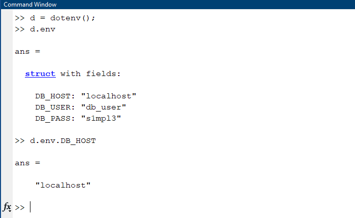

# MATLAB dotenv
> A MATLAB implementation of the common dotenv pattern. 

Storing configuration in the environment separate from code is based on [The Twelve-Factor App](https://12factor.net/config) methodology. MATLAB dotenv lets you store configuration data in a `.env` file. You can share your code files without sharing your configuration data.



## Installation
Put `Dotenv.m` somewhere on your [search path](https://www.mathworks.com/help/matlab/ref/path.html).

## Usage Example
`Dotenv()` will try and load a file named `.env` from the current working folder. Alternatively, you can specify the path with `Dotenv('path/to/file.env')`.

`.env`
```text
API_KEY=ybvxtzwaxa:r42DtRhuUT7TywYpzBABOFZ0IIomwuIEXnfFVq2VSXjRC
```

`file.m`
```matlab
d = Dotenv();
opts = weboptions('HeaderField', ["accept", "any"; "authorization", d.env.API_KEY])
url = "https://myurl.com"
response = webread(url, opts);
```
Common places you may need to do this are [`weboptions()`](https://www.mathworks.com/help/matlab/ref/weboptions.html), the [Database Toolbox](https://www.mathworks.com/help/database/ug/database.odbc.connection.html), or [`ftp()`](https://www.mathworks.com/help/matlab/ref/ftp.html).

## Rules
The parsing engine currently supports the following rules:
* empty lines are skipped
* lines beginning with `#` are treated as comments
* empty values become empty strings (`DB_HOST=` becomes `DBHOST: ''`)
* whitespace is removed from both ends of unquoted values (`DB_HOST=some server` becomes `DB_HOST:'some server`)
* quoted values are escaped (`DB_PASS=" some password "` becomes `DB_PASS:' some password'`)

## FAQ
### Should I commit my `.env` file?
No. You should put `*.env` in your `.gitignore` file.

## Development Setup
Clone the repository. You can run `runtests('tests')` from the project root to run the unit test suite.

## Contributing
1. Fork it
2. Create your feature branch (`git checkout -b feature/fooBar`)
3. Commit your changes (`git commit -am 'Add some fooBar'`)
4. Push to the branch (`git push origin feature/fooBar`)
5. Create a new Pull Request